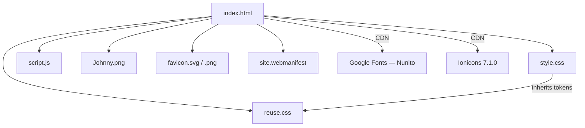
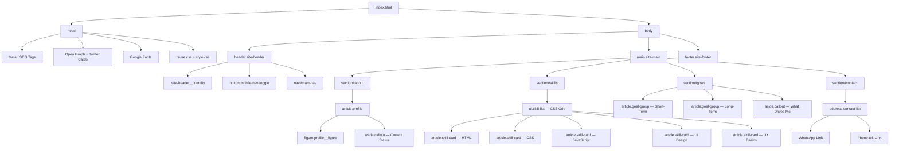
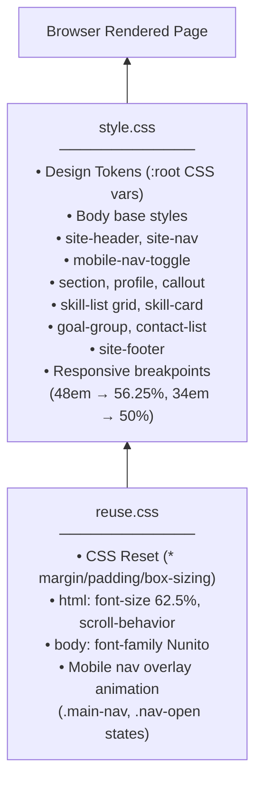
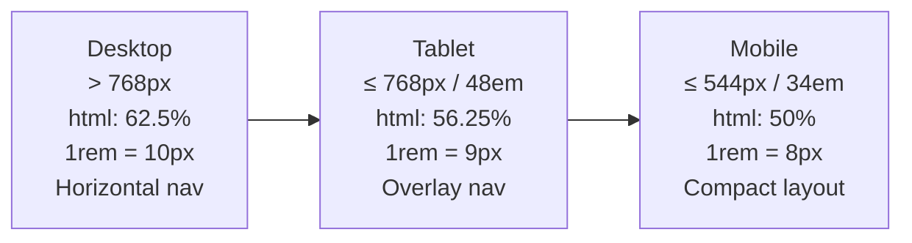
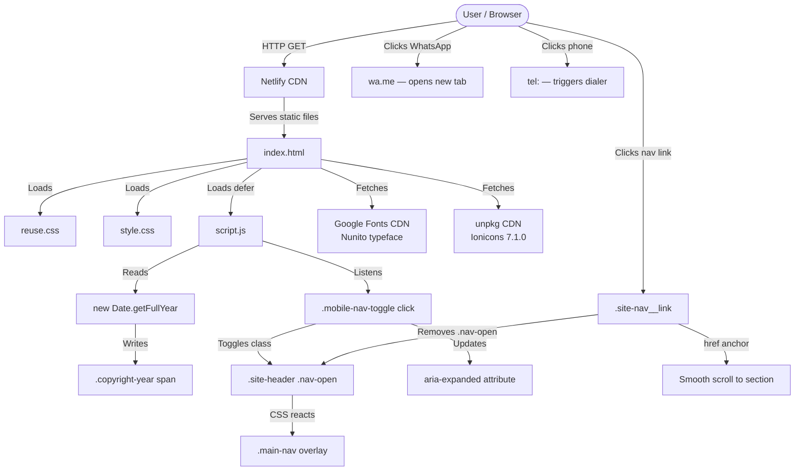

# Johnny Emad — Portfolio Website: Project Documentation

---

## Table of Contents

1. [Project Overview](#1-project-overview)
2. [Project Structure](#2-project-structure)
3. [Architecture & Design Patterns](#3-architecture--design-patterns)
4. [Application Flow](#4-application-flow)
5. [Dependencies & Integrations](#5-dependencies--integrations)
6. [Setup & Running Steps](#6-setup--running-steps)
7. [Diagrams](#7-diagrams)

---

## 1. Project Overview

### Purpose

This is a **personal portfolio website** for Johnny Emad, a Junior Front-End Developer & UI/UX Designer from Egypt. The site serves as a professional online presence to showcase his identity, technical skills, learning goals, and contact information to potential employers, collaborators, and clients.

It is deployed at: [https://johnnyemad.netlify.app/](https://johnnyemad.netlify.app/)

### Main Features & Functionality

- **About / Intro Section** — Personal introduction with a profile photo, bio paragraphs, and a "current status" callout card.
- **Skills Section** — A responsive card grid showcasing five core skills: HTML, CSS, JavaScript, UI Design, and UX Basics.
- **Goals Section** — Short-term goals and long-term ambitions presented as styled lists, plus a personal motivation callout.
- **Contact Section** — Direct contact links via WhatsApp and phone number.
- **Sticky Navigation Header** — Always-visible top bar with smooth-scroll anchor links.
- **Responsive Mobile Navigation** — A fullscreen overlay menu triggered by a hamburger/close toggle button on small screens.
- **PWA-Ready** — Includes a `site.webmanifest` for installability on mobile devices.
- **SEO Optimized** — Full Open Graph, Twitter Card, canonical URL, sitemap, and robots.txt setup.
- **Dynamic Copyright Year** — JavaScript automatically updates the footer year.
- **Accessibility-First** — Semantic HTML5, ARIA labels, `aria-expanded` state management, and `focus-visible` styles throughout.

---

## 2. Project Structure

```
portfolio/
│
├── index.html              # Single-page application entry point (all content)
├── style.css               # Project-specific styles, design tokens, layout
├── reuse.css               # Global reusable system (reset, base, mobile nav overlay)
├── script.js               # JavaScript: copyright year + mobile nav toggle logic
│
├── Johnny.png              # Developer profile photo
├── favicon.svg             # SVG favicon (modern browsers)
├── favicon-32x32.png       # PNG favicon fallback (32×32)
├── favicon-16x16.png       # PNG favicon fallback (16×16)
├── apple-touch-icon.png    # Apple home screen icon (180×180)
│
├── site.webmanifest        # PWA manifest (name, icons, theme color, display mode)
├── sitemap.xml             # XML sitemap for search engine crawlers
├── robots.txt              # Crawler directives + sitemap reference
└── googlee6a48fb894e0d8e7.html  # Google Search Console site verification file
```

### Key File Explanations

| File | Role |
|---|---|
| `index.html` | The entire site lives in one HTML file. Contains all four sections, the header, footer, and all semantic markup. |
| `style.css` | Defines CSS custom properties (design tokens), component styles, hover/focus states, and responsive breakpoints. |
| `reuse.css` | A portable CSS system: CSS reset, base `html`/`body` rules, and the reusable mobile nav overlay animation. Marked "DO NOT modify". |
| `script.js` | Two responsibilities: auto-update the copyright year and manage the mobile nav open/close toggle with ARIA state. |
| `site.webmanifest` | Enables "Add to Home Screen" on Android/iOS. Defines app name, icons, theme color, and standalone display mode. |
| `sitemap.xml` | Lists all five anchor URLs for search engine indexing with priority and change frequency hints. |
| `robots.txt` | Allows all crawlers and points them to the sitemap. |

---

## 3. Architecture & Design Patterns

### Frameworks & Libraries

This project is intentionally **framework-free**. It uses only:

| Technology | Version / Source | Role |
|---|---|---|
| HTML5 | Native | Semantic page structure |
| CSS3 | Native | Styling, layout, animations |
| Vanilla JavaScript | Native (ES5+) | DOM interaction, IIFE pattern |
| Google Fonts — Nunito | CDN (`fonts.googleapis.com`) | Primary typeface |
| Ionicons | CDN (`unpkg.com` v7.1.0) | Icon set (hamburger / close icons) |

### CSS Architecture

The styling is split into two deliberate layers:

```
reuse.css   →  Global foundation (reset + mobile nav system)
style.css   →  Project-specific tokens, components, and layout
```

**Design Token System** — All visual values are defined as CSS Custom Properties on `:root`:

```css
:root {
  --color-primary:   #4f46e5;   /* indigo */
  --color-accent:    #06b6d4;   /* cyan   */
  --fs-base:         1.6rem;
  --space-6:         2.4rem;
  --radius-full:     9999rem;
  --transition-normal: 0.25s ease;
  /* ... and more */
}
```

This makes the entire design system consistent and easy to update from a single location.

**Responsive Scaling Strategy** — Rather than rewriting individual component sizes per breakpoint, the project scales the `html` root font size:

```css
/* Tablet ≤ 768px */
@media (max-width: 48em) { html { font-size: 56.25%; } }

/* Mobile ≤ 544px */
@media (max-width: 34em) { html { font-size: 50%; } }
```

Since all values use `rem`, this single change proportionally scales the entire layout.

**BEM-Inspired Naming** — Class names follow a Block-Element pattern:

```
.site-header                 → Block
.site-header__name           → Element
.site-nav__link              → Element
.section--about              → Modifier
.skill-card                  → Block
.skill-card__title           → Element
```

### JavaScript Pattern

The JS uses an **IIFE (Immediately Invoked Function Expression)** to encapsulate the nav toggle logic and avoid polluting the global scope:

```js
(function () {
  const header    = document.querySelector(".site-header");
  const toggleBtn = document.querySelector(".mobile-nav-toggle");
  const navLinks  = document.querySelectorAll(".site-nav__link");

  toggleBtn.addEventListener("click", function () {
    const isOpen = header.classList.toggle("nav-open");
    toggleBtn.setAttribute("aria-expanded", isOpen);
    // ...
  });
})();
```

### State Management

There is no client-side state library. UI state is managed through **CSS class toggling**:

- `header.classList.toggle("nav-open")` — the single source of truth for whether the mobile menu is open or closed.
- CSS in `reuse.css` reacts to `.nav-open` to animate the overlay in/out.
- ARIA attributes (`aria-expanded`, `aria-label`) are kept in sync with the class state by JavaScript.

---

## 4. Application Flow

### Page Load Sequence

```
1. Browser requests index.html
2. <head> loads:
   a. reuse.css  (reset + mobile nav system)
   b. style.css  (design tokens + components)
   c. Google Fonts (Nunito — preconnect for speed)
3. <body> renders:
   a. Sticky header with identity + nav links
   b. Four content sections (about, skills, goals, contact)
   c. Footer
4. Ionicons scripts load (ESM + nomodule fallback)
5. script.js runs (defer):
   a. Updates .copyright-year with current year
   b. Attaches click listener to .mobile-nav-toggle
   c. Attaches click listeners to all .site-nav__link items
```

### Key User Flows

#### Flow 1 — Desktop Navigation

```
User sees sticky header
  → Clicks a nav link (e.g. "Skills")
    → Browser smooth-scrolls to #skills section
      → Nav link hover shows indigo pill with lift effect
```

#### Flow 2 — Mobile Navigation

```
User on ≤ 768px screen
  → Hamburger button visible in header
    → User taps hamburger
      → JS toggles .nav-open on .site-header
        → CSS animates fullscreen overlay in (translateX 100% → 0)
          → Close icon replaces hamburger icon
            → User taps a nav link
              → JS removes .nav-open
                → Overlay slides out
                  → Browser smooth-scrolls to target section
```

#### Flow 3 — Skill Card Interaction

```
User hovers over a skill card
  → Card lifts (translateY -0.4rem)
  → Background brightens
  → Border gets indigo tint
  → Shadow deepens with indigo glow
```

#### Flow 4 — Contact

```
User clicks "Message me on WhatsApp"
  → Opens wa.me link in a new tab (rel="noopener noreferrer")
    → WhatsApp web/app opens with pre-filled number

User clicks phone number
  → tel: link triggers device dialer
```

---

## 5. Dependencies & Integrations

### External Libraries

| Dependency | Source | Version | Role |
|---|---|---|---|
| **Google Fonts — Nunito** | `fonts.googleapis.com` | Latest | Primary typeface (weights 400, 600, 700, 800) |
| **Ionicons** | `unpkg.com` | 7.1.0 | Web component icon library — provides `menu-outline` and `close-outline` icons for the mobile nav toggle |

### External Integrations

| Integration | Details |
|---|---|
| **Netlify** | Hosting platform. Site deployed at `https://johnnyemad.netlify.app/` |
| **Google Search Console** | `googlee6a48fb894e0d8e7.html` is the HTML file verification method for GSC ownership |
| **WhatsApp** | `https://wa.me/201208534347` — direct chat link using the WhatsApp API URL scheme |
| **Open Graph Protocol** | Facebook, LinkedIn, Discord, WhatsApp link previews via `og:` meta tags |
| **Twitter/X Cards** | Rich link previews on Twitter/X via `twitter:` meta tags |

### PWA Integration

The `site.webmanifest` enables Progressive Web App features:

```json
{
  "name": "Johnny Emad — Front-End Developer",
  "display": "standalone",
  "theme_color": "#4f46e5",
  "background_color": "#f8fafc"
}
```

This allows the site to be installed on Android/iOS home screens and run in a standalone window without browser chrome.

---

## 6. Setup & Running Steps

### Prerequisites

No build tools, package managers, or runtimes are required. This is a **pure static site**.

### Installation

```bash
# Clone or download the repository
git clone <repository-url>
cd portfolio
```

### Running Locally

Since this is a static site, you can serve it with any local HTTP server.

**Option A — VS Code Live Server (recommended)**
1. Install the [Live Server extension](https://marketplace.visualstudio.com/items?itemName=ritwickdey.LiveServer)
2. Right-click `index.html` → **Open with Live Server**

**Option B — Python**
```bash
# Python 3
python -m http.server 8080

# Then open: http://localhost:8080
```

**Option C — Node.js (npx)**
```bash
npx serve .
# Then open the URL shown in the terminal
```

### Deployment

The site is deployed on **Netlify**. To deploy your own copy:

1. Push the project to a GitHub/GitLab repository.
2. Connect the repository to [Netlify](https://netlify.com).
3. Set the **publish directory** to `/` (root).
4. No build command is needed — Netlify serves the static files directly.

### Environment Notes

- No `.env` files or environment variables are used.
- No API keys are required.
- All external resources (fonts, icons) are loaded from public CDNs.

---

## 7. Diagrams

### 7.1 — File Dependency Graph



---

### 7.2 — HTML Section Hierarchy



---

### 7.3 — Mobile Navigation State Machine

```mermaid
stateDiagram-v2
    [*] --> Closed : Page Load

    Closed --> Open : User clicks hamburger button
    Open --> Closed : User clicks close button
    Open --> Closed : User clicks any nav link

    state Closed {
        direction LR
        css: .nav-open NOT on header
        icon: menu-outline visible
        overlay: translateX(100%) — off screen
        aria: aria-expanded = false
    }

    state Open {
        direction LR
        css: .nav-open ON header
        icon: close-outline visible
        overlay: translateX(0) — fullscreen
        aria: aria-expanded = true
    }
```

---

### 7.4 — CSS Layering Architecture



---

### 7.5 — Responsive Breakpoint System



---

### 7.6 — Data Flow Diagram



---

*Documentation generated by analyzing the full project source. Last updated: May 2026.*
